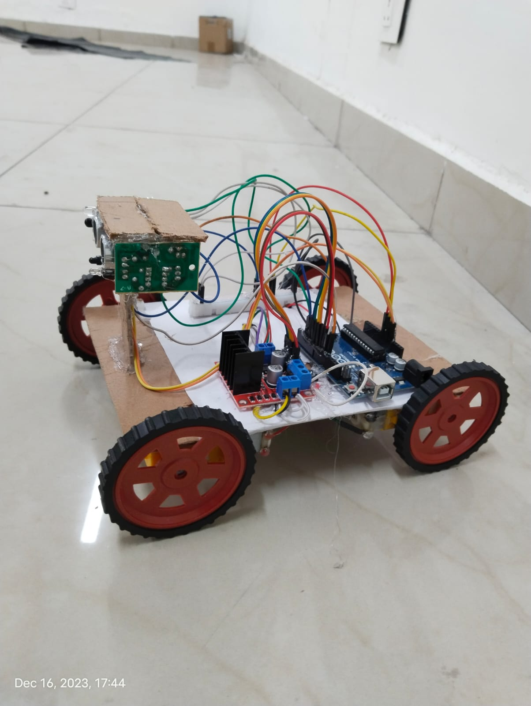
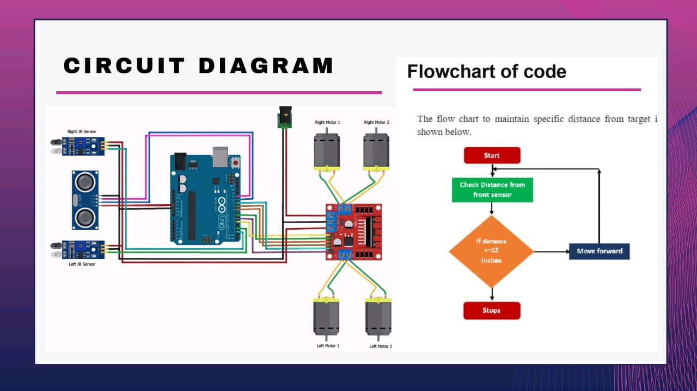

# Human Following Robot (HFR)

This is an Arduino-based robot that follows a human using ultrasonic and IR sensors.  
It automatically adjusts direction based on IR feedback and obstacle distance.

---

## 📸 Project Photo

## 🔌 Circuit Diagram

---

## ⚙️ Features
- Ultrasonic distance measurement
- IR sensors for direction correction
- Motor control using L298N
- PWM speed control
- Real-time debugging with Serial Monitor

---

## 🧰 Components Used
- Arduino UNO  
- HC-SR04 Ultrasonic Sensor  
- IR Sensors  
- L298N Motor Driver  
- DC Motors  
- 12V Battery Supply  

---

## 👨‍🔧 My Role
- Wrote Arduino code (see `hfr_code.ino`)
- Designed the circuit and assembled the hardware
- Calibrated motor speeds and distance sensing

---

## 📂 Files in this Repository
- `hfr_code.ino` — Arduino program  
- `robot_photo.jpg` — Actual working robot  
- `circuit_diagram.png` — Circuit wiring  
- `README.md` — Project overview

---

⭐ Originally developed in 2023, documented for portfolio use.
